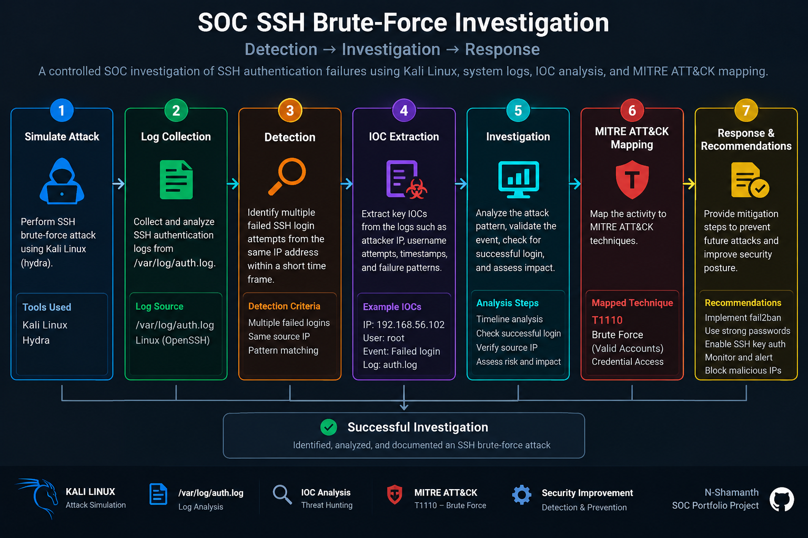
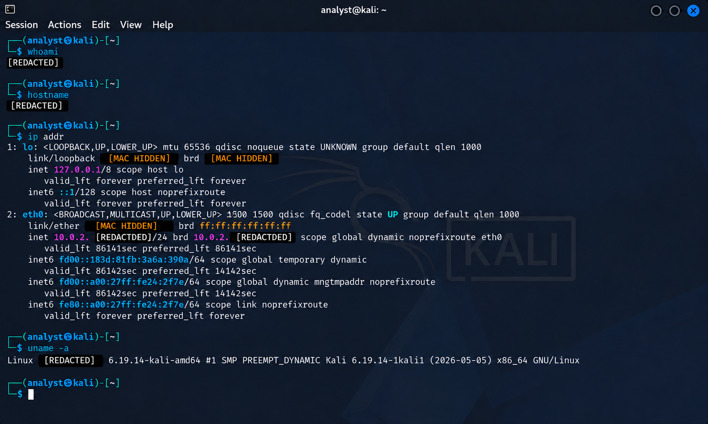
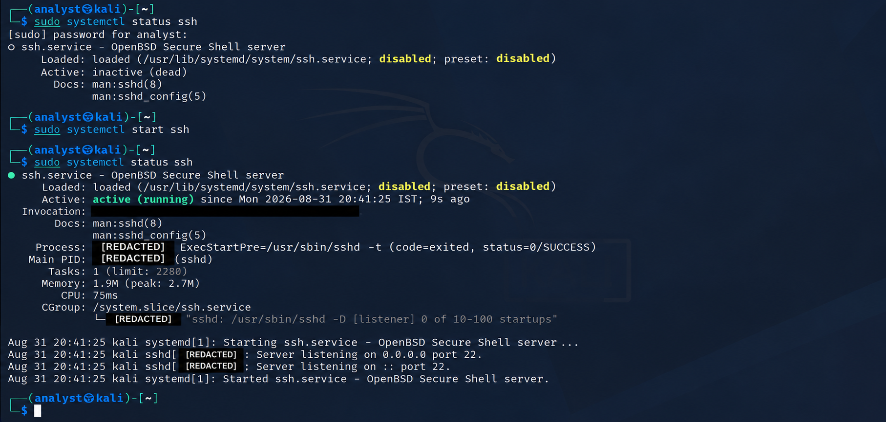
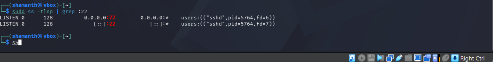
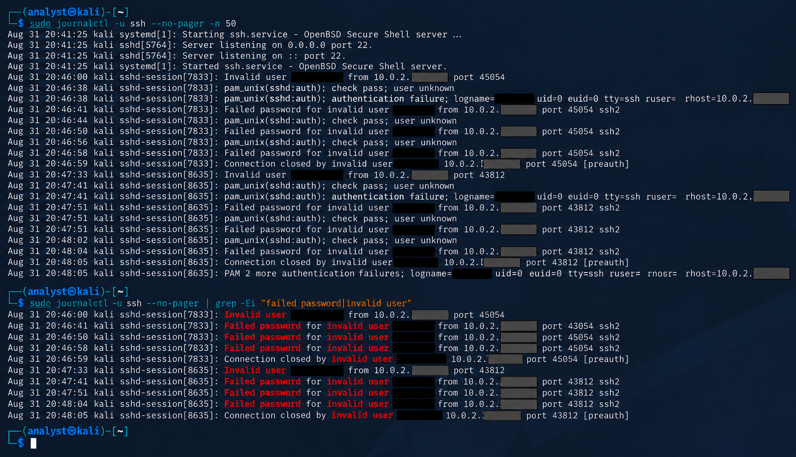
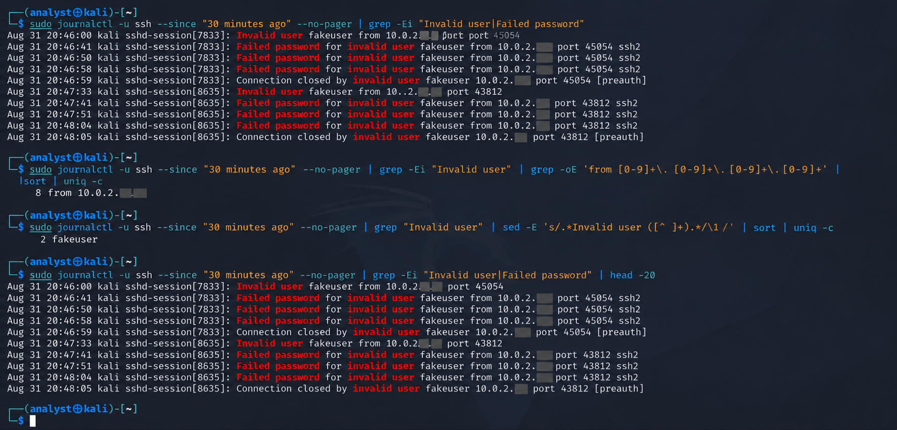
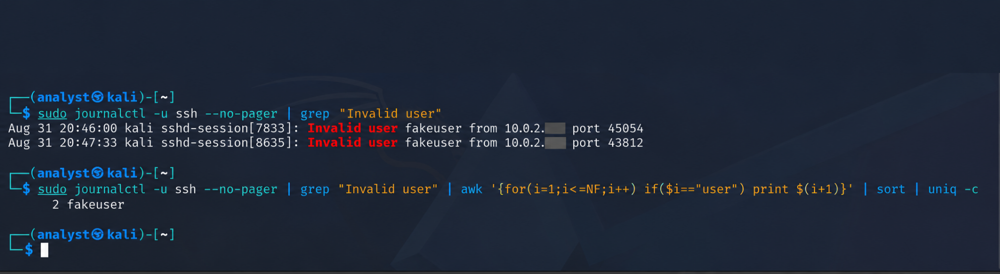
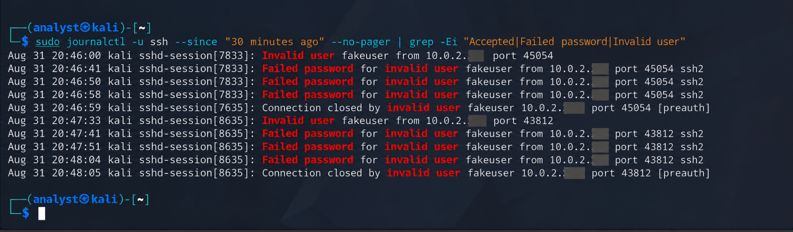
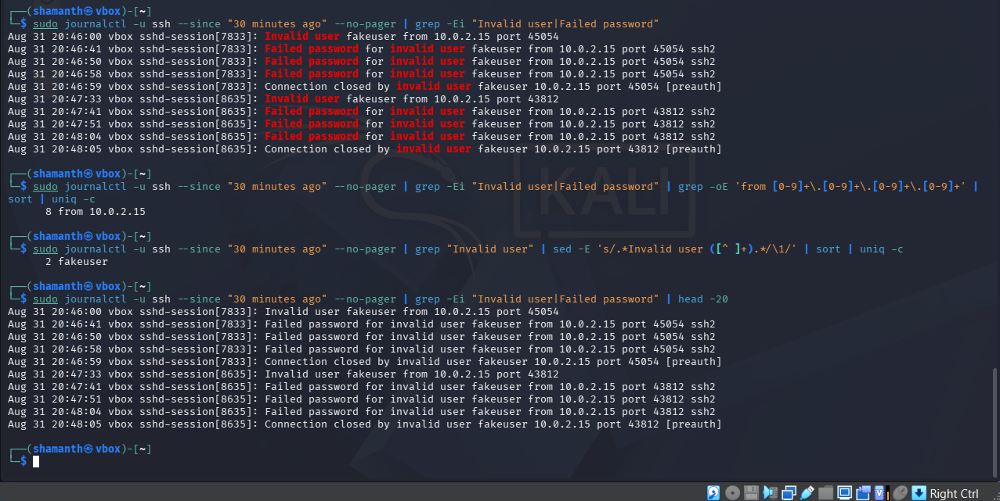

# SOC SSH Brute-Force Investigation

## Overview

This project demonstrates a controlled Security Operations Center (SOC) investigation of SSH authentication activity in a Kali Linux virtual machine running in VirtualBox.

The lab simulates repeated SSH authentication failures and demonstrates how a SOC analyst can collect logs, detect suspicious authentication activity, identify indicators of compromise, investigate the authentication outcome, map the activity to MITRE ATT&CK, and document the incident.

## Objectives

- Configure and monitor an SSH service.
- Generate controlled SSH authentication failures.
- Collect SSH authentication events.
- Analyze systemd journal logs.
- Identify suspicious source IP addresses.
- Identify targeted usernames.
- Determine whether authentication was successful.
- Extract indicators of compromise.
- Map observed behavior to MITRE ATT&CK.
- Document the investigation and recommended defensive actions.

## Lab Environment

| Component | Details |
|---|---|
| Operating System | Kali Linux |
| Virtualization | VirtualBox |
| SSH Server | OpenSSH |
| Log Source | systemd journal |
| Protocol | SSH |
| Destination Port | 22 |
| Lab IP | 10.0.2.15 |

## Investigation Scenario

A controlled SSH authentication attack was simulated against the Kali Linux virtual machine.

The test generated authentication events involving the invalid username `fakeuser` and incorrect passwords.

The authentication attempts were intentionally generated from the Kali Linux VM itself. Therefore, `10.0.2.15` represents the lab machine and should not be interpreted as an external attacker IP.

## Detection

SSH service status was verified using:

    sudo systemctl status ssh

SSH port 22 was verified using:

    sudo ss -tlnp | grep :22

SSH authentication events were reviewed using:

    sudo journalctl -u ssh --no-pager

Authentication failures were filtered using:

    sudo journalctl -u ssh --no-pager | grep -Ei "failed password|invalid user"

## Investigation Findings

The investigation identified the following activity:

| Finding | Result |
|---|---|
| Source IP | 10.0.2.15 |
| Target Username | fakeuser |
| SSH Port | 22 |
| Source Ports | 45054, 43812 |
| Invalid User Events | 2 |
| Failed Password Events | 6 |
| Activity Window | Approximately 20:46–20:48 |
| Successful Authentication | Not observed |

## IOC Analysis

The source IP was extracted from the SSH logs using:

    sudo journalctl -u ssh --no-pager | grep -Ei "failed password|invalid user" | grep -oE 'from [0-9]+\.[0-9]+\.[0-9]+\.[0-9]+' | sort | uniq -c

The targeted username was identified using:

    sudo journalctl -u ssh --no-pager | grep "Invalid user" | sed -E 's/.*Invalid user ([^ ]+).*/\1/' | sort | uniq -c

The investigation identified `10.0.2.15` as the source IP and `fakeuser` as the targeted invalid username.

## Authentication Outcome

The logs were reviewed for both failed and successful authentication events.

No `Accepted` authentication event was observed during the investigated activity.

Therefore, the lab demonstrated an attempted authentication attack without evidence of successful SSH authentication.

## MITRE ATT&CK Mapping

### T1110 - Brute Force

The observed activity is mapped to:

**MITRE ATT&CK T1110 - Brute Force**

The controlled simulation involved repeated authentication attempts against an SSH service using an invalid username and incorrect passwords.

## Attack Timeline

| Time | Event |
|---|---|
| 20:46:00 | Invalid SSH user `fakeuser` observed |
| 20:46:41 | Failed password attempt observed |
| 20:46:50 | Failed password attempt observed |
| 20:46:58 | Failed password attempt observed |
| 20:46:59 | Connection closed |
| 20:47:33 | Invalid SSH user `fakeuser` observed |
| 20:47:41 | Failed password attempt observed |
| 20:47:51 | Failed password attempt observed |
| 20:48:04 | Failed password attempt observed |
| 20:48:05 | Connection closed |

## Impact Assessment

No successful SSH authentication was observed during the investigation.

There was no evidence of a successful compromise in this controlled simulation.

The activity therefore represents an authentication attack attempt rather than a confirmed system compromise.

## Recommended Defensive Actions

### Authentication

- Use strong and unique passwords.
- Prefer SSH key-based authentication where appropriate.
- Disable direct root SSH login where appropriate.
- Remove unnecessary user accounts.
- Use multi-factor authentication where supported.

### Network Security

- Restrict SSH access to trusted networks.
- Use firewall rules to restrict TCP port 22.
- Avoid unnecessary public exposure of SSH.
- Consider VPN-based access for administrative SSH.

### Monitoring

- Monitor SSH authentication failures.
- Alert on repeated failures from the same source.
- Monitor invalid username attempts.
- Centralize authentication logs.
- Create detection rules for abnormal authentication patterns.
- Correlate failed and successful authentication events.

## Evidence

Screenshots from the investigation are stored in the `screenshots` directory.

### Lab Environment

### SSH Service

### SSH Port

### Failed SSH Logins

### Attack Analysis

### Targeted User

### Authentication Outcome

### IOC Extraction

### SOC Investigation Workflow

## Project Structure

    SOC-SSH-Brute-Force-Investigation/
    ├── README.md
    ├── documentation/
    │   └── incident-report.md
    ├── logs/
    │   └── sample-auth.log
    └── screenshots/
        ├── 01-lab-environment.png
        ├── 02-ssh-service-running.png
        ├── 03-ssh-port-listening.png
        ├── 04-failed-ssh-logins.png
        ├── 05-attack-analysis.png
        ├── 06-targeted-user.png
        ├── 07-authentication-outcome.png
        └── 08-ioc-extraction.png

## Skills Demonstrated

- Linux Administration
- Kali Linux
- VirtualBox
- OpenSSH
- SSH Monitoring
- systemd Journal Analysis
- Linux Log Analysis
- Authentication Event Investigation
- IOC Identification
- Source IP Analysis
- Incident Investigation
- MITRE ATT&CK
- Basic Incident Response
- Security Documentation

## Disclaimer

This project was performed in a controlled personal lab environment using a Kali Linux virtual machine.

The authentication activity was intentionally generated for security learning and SOC investigation practice.

No unauthorized systems were targeted.

## Conclusion

This project demonstrates a practical SOC workflow from security event generation and log collection through detection, investigation, IOC identification, MITRE ATT&CK mapping, impact assessment, and incident documentation.

The exercise demonstrates how a SOC analyst can investigate SSH authentication failures and determine whether suspicious authentication activity resulted in a successful login.
